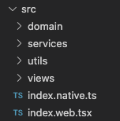

[](https://github.com/Mnogo-Bukv/MnogoBukv/actions/workflows/status.yml)
[](https://codecov.io/gh/Mnogo-Bukv/MnogoBukv)
[](https://github.com/plantain-00/type-coverage)

# Roadmap / приоритеты

1. Мобильное приложение под Android с экранами "Меню", "Игра", "Конец игры", "Об игре".
2. PWA с теми же экранами.
3. Экран "Рекорды" и сервер для хранения рекордов.
4. Мобильное приложение под iOS - ?

# Начало работы

```
npm i
```

Запуск под разные платформы:

```
npm run android
npm run web
```

# Структура приложения



- `utils` - платформо-<b>не</b>зависимый код общего назначения
- `services` - платформо-зависимый код общего назначения
- `domain` - бизнес логика
- `views` - компоненты и UI-логика
- `index.native.ts` - корень мобильного приложения
- `index.web.tsx` - корень web-приложения

# Правила импортирования

В `utils` можно импортировать только из `utils`.<br/>
В `services` - только из `utils` и `services`.<br/>
В `domain` - только из `utils`, `services` и `domain`.<br/>
Вo `views` - откуда угодно.<br/>

```js
// .eslintrc
"import/no-restricted-paths": [
  "error",
  {
    "zones": [
      { "target": "./src/utils", "from": "./src/services" },
      { "target": "./src/utils", "from": "./src/domain" },
      { "target": "./src/utils", "from": "./src/views" },
      { "target": "./src/services", "from": "./src/domain" },
      { "target": "./src/services", "from": "./src/views" },
      { "target": "./src/domain", "from": "./src/views" }
    ]
  }
]
```

В `utils` и `domain` не должно быть платформо-зависимого кода.

```js
// src/domain/.eslintrc
"no-restricted-imports": ["error", { "patterns": ["react", "react-*", "rn-*"] }]
```

Экспорт "наружу" только через `index`-файлы.

```js
// .eslintrc
"import/no-internal-modules": ["error"]
```

# Структура компонента


- `*.d.ts` - общий интерфейс
- `*.native.tsx` - мобильная версия компонента
- `*.web.tsx` - web-версия компонента
- `*.nss.ts` - мобильные стили
- `*.css.ts` - web-стили
- `index.ts` - экспорты

Если компонент предназначен только под одну платформу, то может выглядеть так:

 

# Приоритеты расширений файлов

Бандлеры выбирают файлы для сборки согласно приоритетам:

Android: `*.android.ts` > `*.native.ts` > `*.ts`.<br/>
iOS: `*.ios.ts` > `*.native.ts` > `*.ts`.<br/>
web: `*.web.ts` > `*.ts`.<br/>

123
